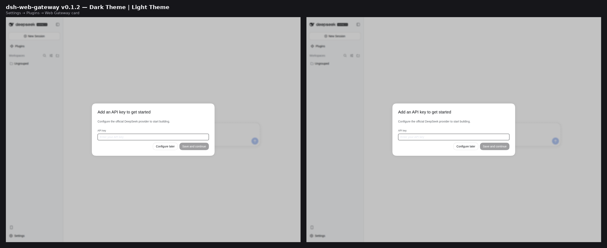

# 📦 @goodandready/dsh-web-gateway

<div align="center">

<h3>Resilient Web Search & SSRF-Safe Markdown Extract Fallback Chain for DeepSeek Harness</h3>

<p align="center">
  <a href="https://www.npmjs.com/package/@goodandready/dsh-web-gateway"></a>
  <a href="LICENSE"></a>
  <a href="https://github.com/topics/dsh-plugin"></a>
  <a href="https://nodejs.org"></a>
</p>

<p align="center">
  <a href="https://goodandready.app/"></a>
</p>

<p align="center">
  <a href="README.md"><b>🇬🇧 English</b></a> •
  <a href="README.zh.md"><b>🇨🇳 中文说明</b></a> •
  <a href="README.ru.md"><b>🇷🇺 Русский</b></a>
</p>

<table align="center">
  <tr>
    <td align="center">
      ⭐ <strong>If you like this plugin, please star it on GitHub</strong> — it shows me that the plugin is useful to you and motivates me to keep developing it.
      <br><br>
      🐛 <strong>If you find a bug or would like to request a feature</strong>, open a GitHub issue in any language — I will review your proposal and implement useful suggestions in a future plugin version.
    </td>
  </tr>
</table>

</div>

---

Resilient **web search** and **page extract** tools for [DeepSeek Harness](https://github.com/deepseek-ai/deepseek-harness).

When the built-in `web_search` / `web_fetch` tools hit rate limits, captchas, or empty results, this plugin gives the model a separate fallback chain with different tool names (no registration collisions).

## Tools

| Tool | Purpose |
|---|---|
| `web_gateway_search` | Search the web. Chain: **Tavily → Firecrawl → Exa → local SearXNG** |
| `web_gateway_extract` | Fetch a URL as markdown. Chain: **Firecrawl → Tavily → Crawl4AI → Jina → readability** |
| `web_gateway_research` | Search + extract top sources into a capped multi-source brief |

A provider is skipped on missing key, empty result, HTTP 429/5xx, or network error. Results are cached in memory (configurable TTL). Successful responses include `provider`, `skipped` (providers not used and why), and `cached`.

Extract URLs are validated: **http/https only**, no embedded credentials, and hostnames must resolve to **public** IPs (loopback / RFC1918 / link-local / metadata blocked). Set `allowInternalUrls` only if you intentionally need internal targets.

## Install

```bash
dsh plugin --profile web add @goodandready/dsh-web-gateway
```

Restart the web profile after install.

## Credentials

Add keys under **Settings → Credentials** (or `$DSH_HOME/.credentials.yaml`). The settings card stores only **credential names**, never secret values:

| Default name | Used by |
|---|---|
| `TAVILY_API_KEY` | search + extract |
| `FIRECRAWL_API_KEY` | search + scrape |
| `EXA_API_KEY` | search |
| `CRAWL4AI_TOKEN` | extract (only if `crawl4aiUrl` is set) |

## Settings

Configure in **Settings → Plugins → Web Gateway**:

| Setting | Default | Meaning |
|---|---|---|
| `defaultLimit` | `5` | Default search result count |
| `maxLimit` | `20` | Hard search cap |
| `timeoutMs` | `30000` | Per-provider timeout |
| `cacheTtlMs` | `600000` | In-memory cache TTL (`0` disables) |
| `searxngUrl` | empty | Local SearXNG base URL; empty disables |
| `crawl4aiUrl` | empty | Crawl4AI base URL; empty disables |
| `includeDomains` / `excludeDomains` | empty | Search domain allow/deny lists |
| `freshness` | `any` | `any` / `day` / `week` / `month` |
| `diskCacheEnabled` | `true` | Persist cache under the DSH profile |
| `dailyCap*` | `0` | Per-provider daily caps (`0` = unlimited, UTC day) |
| `searchProviderOrder` | `tavily,firecrawl,exa,searxng` | Comma-separated search provider order |
| `extractProviderOrder` | `firecrawl,tavily,crawl4ai` | Comma-separated extract provider order |
| `allowInternalUrls` | `false` | Allow private/loopback extract targets |

## How it relates to core DSH web tools

DeepSeek Harness already ships `web_search` and `web_fetch` via `@deepseek-ai/dsh-tool-web`. This plugin does **not** replace them. It registers `web_gateway_*` tools so the model can fall back when the built-in path fails.

## Development

```bash
npm test
npm run check
```

Tests run offline with mocked `fetch` (no live network).

## Visual verification

Plugins settings card for Web Gateway — Dark and Light themes side by side:



## License

MIT © [GooDAnDReaDY](https://github.com/GooDAnDReaDY)
